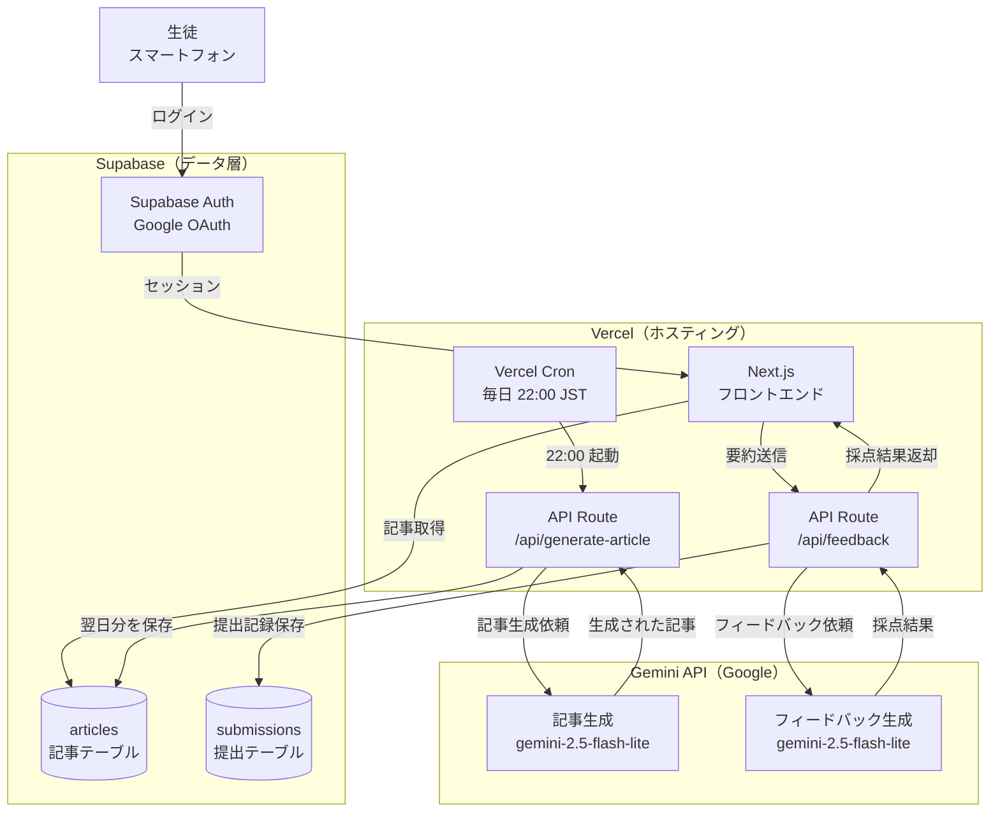
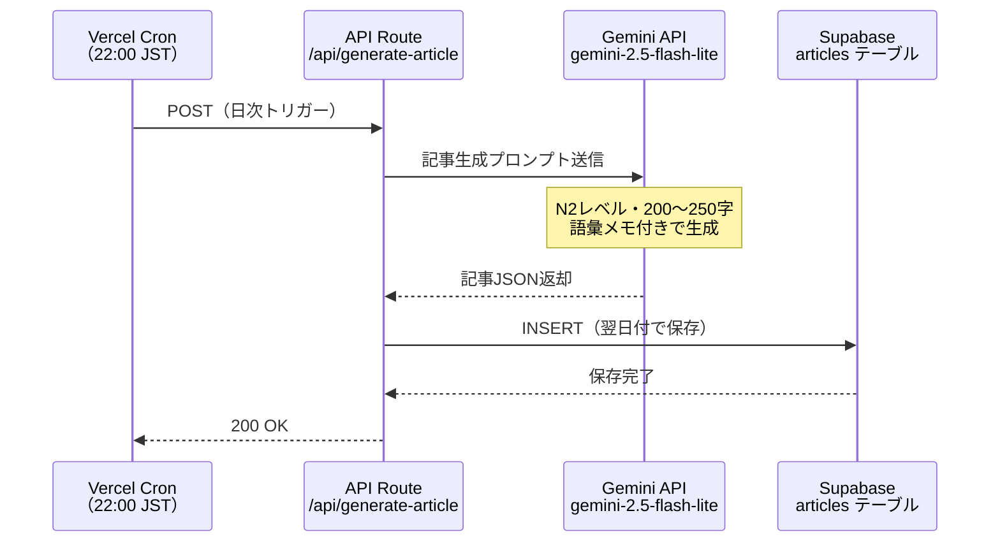
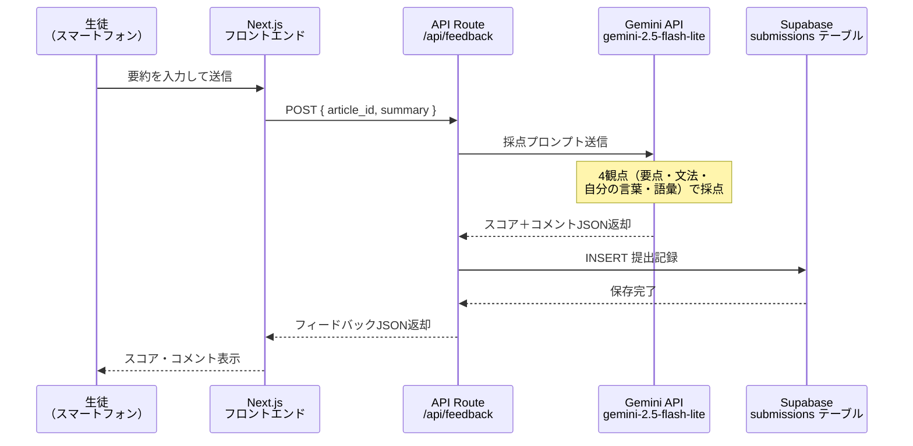

# N2読解練習アプリ 設計書

**バージョン**: 0.2  
**作成日**: 2026-03-31  
**対象**: JLPT N2レベルの外国人留学生  
**担当**: 清風情報工科学院

---

## 1. システム概要

### 目的

毎朝、前日のニュース記事（約200〜250字）を生徒のスマートフォンに提供し、80〜120字の要約を書かせる。提出後にGemini APIが4つの観点でフィードバックを生成することで、読解力・要約力・日本語表現力の向上を図る。

### 想定ユーザー

| 区分 | 説明 |
|------|------|
| 生徒 | JLPT N2〜N3レベルの外国人留学生（数十〜百名規模） |
| 教師 | 記事・提出状況の確認（将来拡張） |

### 利用フロー（生徒）

1. 朝、スマートフォンでアプリを開く
2. 当日の記事（200〜250字）を読む（所要約2分）
3. 要約（80〜120字）をテキストボックスに入力して送信（約1分）
4. Gemini APIによる4観点フィードバックを確認（約2分）
5. 合計：**5分以内に完結**

---

## 2. 技術スタック

| レイヤー | 採用技術 | 理由 |
|----------|----------|------|
| フロントエンド | Next.js (App Router) | 既存スピーチアプリと同構成、即着手可能 |
| ホスティング | Vercel | Cronジョブ対応、CDN自動、無料枠で運用可 |
| データベース | Supabase (PostgreSQL) | 既存構成の流用、RLS・Auth 込み |
| AI（記事生成） | Gemini API `gemini-2.5-flash-lite` | 夜間バッチで記事を自動生成、低コスト |
| AI（フィードバック） | Gemini API `gemini-2.5-flash-lite` | 提出時にリアルタイム採点、低レイテンシ |
| 認証 | Supabase Auth + Google OAuth | i-seifu.jp ドメイン制限 |

> **モデル選定メモ**：`gemini-2.5-flash-lite` はGemini 2.5シリーズで最もコスト効率に優れ、低レイテンシ用途に最適。`gemini-2.0-flash` は2026年6月1日シャットダウン予定のため採用しない。より高品質なフィードバックが必要な場合は `gemini-2.5-flash` へ切り替えを検討。

---

## 3. アーキテクチャ図

### 3-1. 全体構成



### 3-2. 夜間バッチ（記事自動生成）シーケンス



### 3-3. 提出・フィードバックシーケンス



---

## 4. データモデル（概要）

### articles（記事テーブル）

| カラム | 型 | 説明 |
|--------|----|------|
| `id` | uuid | PK |
| `publish_date` | date | 公開日（翌朝に生徒へ表示） |
| `title` | text | 記事タイトル（20〜30字） |
| `body` | text | 本文（200〜250字） |
| `vocab_notes` | jsonb | 語彙メモ（配列） |
| `created_at` | timestamptz | 生成日時 |

### submissions（提出テーブル）

| カラム | 型 | 説明 |
|--------|----|------|
| `id` | uuid | PK |
| `user_id` | uuid | FK → auth.users |
| `article_id` | uuid | FK → articles |
| `summary` | text | 生徒の要約文 |
| `score_overall` | int2 | 総合スコア（0〜100） |
| `scores` | jsonb | 4観点スコア＋コメント |
| `submitted_at` | timestamptz | 提出日時 |

---

## 5. Gemini APIプロンプト仕様

### 5-1. 記事生成プロンプト（夜間バッチ）

```
あなたは日本語教材の作成者です。
JLPT N2レベルの外国人学習者向けに、
以下の条件でニュース記事を1本作成してください。

【条件】
- 本文：200〜250字
- 文体：です・ます調
- テーマ：社会・経済・環境・テクノロジーのいずれか（重複しないよう）
- 難しい語彙には読み仮名と英訳注釈を付ける（3〜5語）
- 架空の内容でも可（日付・数値は具体的に）

【出力形式（JSON のみ、前置きなし）】
{
  "title": "記事タイトル（20〜30字）",
  "body": "本文（200〜250字）",
  "vocab_notes": [
    { "word": "語彙", "reading": "よみ", "meaning": "英訳" }
  ]
}
```

### 5-2. フィードバックプロンプト（提出時）

```
あなたは日本語教師です。
JLPT N2レベルの外国人学生が書いた要約文を
以下の4観点で評価してください。

【元の記事】
{article_body}

【学生の要約】
{summary}

【出力形式（JSON のみ、前置きなし）】
{
  "overall_score": 0〜100の整数,
  "overall_comment": "一言コメント（40字以内）",
  "criteria": [
    { "name": "要点の把握", "score": 0〜100, "comment": "60字以内" },
    { "name": "文法・表現", "score": 0〜100, "comment": "60字以内" },
    { "name": "自分の言葉", "score": 0〜100, "comment": "60字以内" },
    { "name": "語彙レベル", "score": 0〜100, "comment": "60字以内" }
  ]
}
```

### 5-3. API呼び出しサンプル（Next.js API Route）

```typescript
import { GoogleGenerativeAI } from "@google/generative-ai";

const genAI = new GoogleGenerativeAI(process.env.GEMINI_API_KEY!);
const model = genAI.getGenerativeModel({
  model: "gemini-2.5-flash-lite",
  generationConfig: { responseMimeType: "application/json" },
});

const result = await model.generateContent(prompt);
const json = JSON.parse(result.response.text());
```

> `responseMimeType: "application/json"` を指定すると、JSONのみを確実に返してくれるためパース処理が安定する。

---

## 6. 画面構成（概要）

| 画面 | パス | 説明 |
|------|------|------|
| ログイン | `/login` | Google OAuth（ドメイン制限） |
| 今日の記事 | `/` | 記事表示 → 要約入力 → 送信 |
| フィードバック | `/result/[id]` | スコア・コメント表示 |
| 履歴 | `/history`（将来） | 過去の提出一覧 |

---

## 7. 非機能要件

| 項目 | 目標値 |
|------|--------|
| フィードバック応答時間 | 20秒以内 |
| 可用性 | Vercel / Supabase の SLA に準拠 |
| 対応端末 | スマートフォン（iOS Safari / Android Chrome） |
| アクセス制限 | i-seifu.jp Googleアカウントのみ |
| 1日1回制限 | 同一ユーザーの同一記事への複数提出を防ぐ（DB制約） |

---

## 8. 環境変数

| 変数名 | 説明 |
|--------|------|
| `GEMINI_API_KEY` | Google AI Studio で発行したAPIキー |
| `NEXT_PUBLIC_SUPABASE_URL` | Supabase プロジェクトURL |
| `NEXT_PUBLIC_SUPABASE_ANON_KEY` | Supabase 匿名キー |
| `SUPABASE_SERVICE_ROLE_KEY` | Cronジョブ用サービスロールキー |
| `CRON_SECRET` | Vercel Cron 認証トークン |

---

## 9. 今後の拡張候補

- 教師向けダッシュボード（提出率・平均スコアの確認）
- 記事の難易度調整（N3 / N2 / N1 レベル切り替え）
- Google Classroomへの成績エクスポート
- 週次レポートの自動生成・メール配信

---

*このドキュメントは設計の初期版です。実装フェーズで随時更新してください。*
