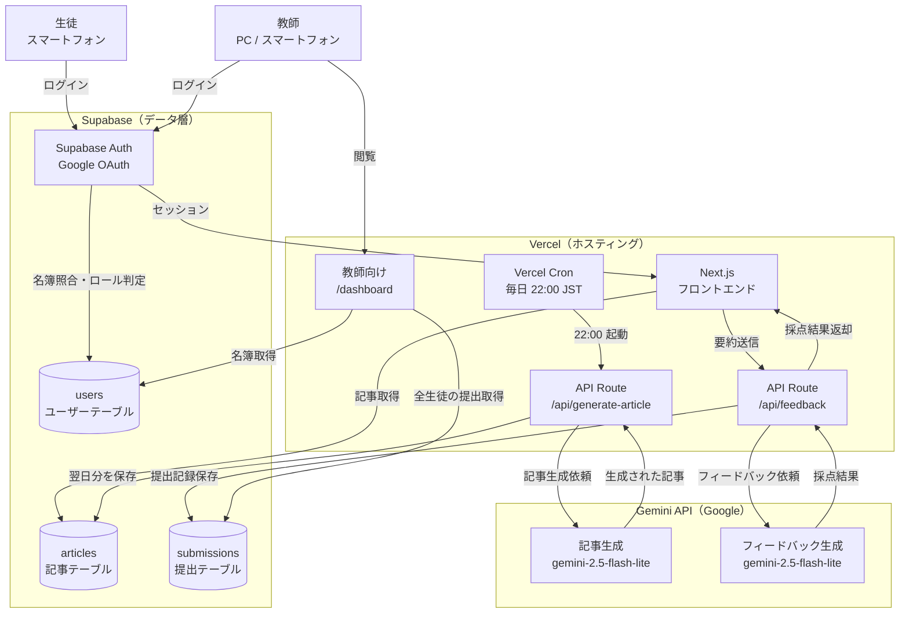
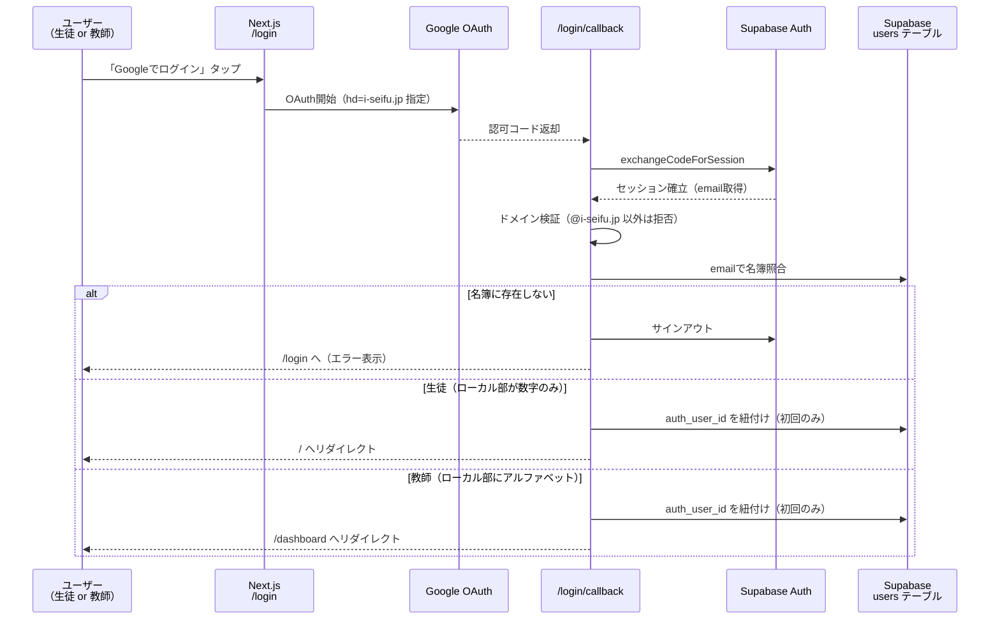
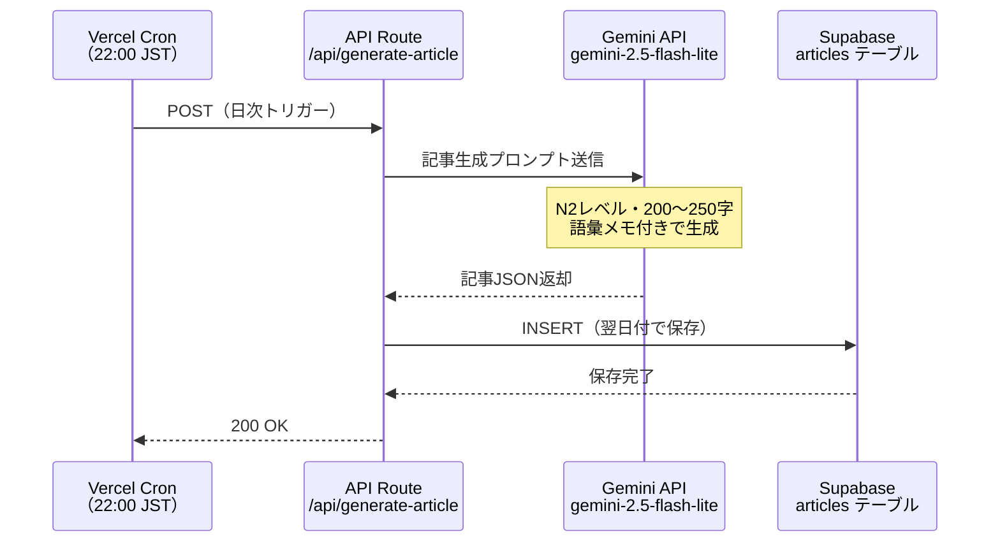
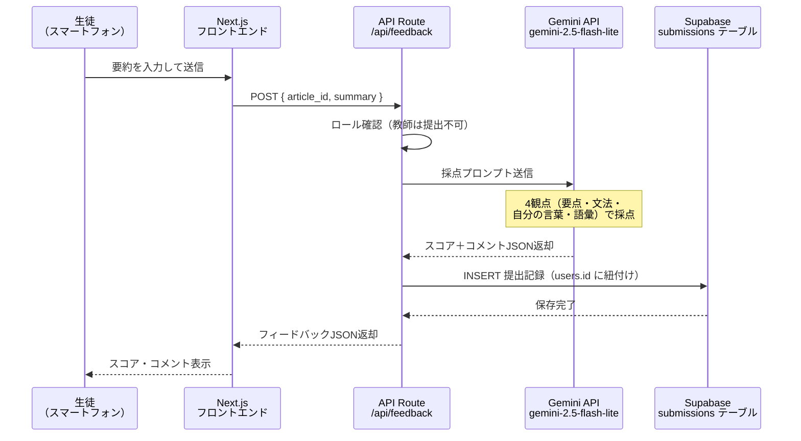
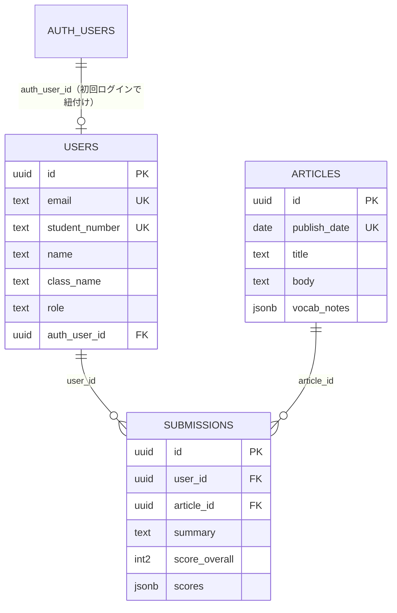

# N2読解練習アプリ 設計書

**バージョン**: 0.3
**作成日**: 2026-03-31
**最終更新**: 2026-06-10
**対象**: JLPT N2レベルの外国人留学生
**担当**: 清風情報工科学院

---

## 改訂履歴

| 版 | 日付 | 内容 |
|----|------|------|
| 0.2 | 2026-03-31 | 初期版（生徒向け読解・採点フロー） |
| 0.3 | 2026-06-10 | ロール判定（生徒/教師）、usersテーブル、教師向けダッシュボードを追加。submissionsをusers参照に変更。過去の問題への遡り提出に対応 |

---

## 1. システム概要

### 目的

毎朝、前日のニュース記事（約200〜250字）を生徒のスマートフォンに提供し、80〜120字の要約を書かせる。提出後にGemini APIが4つの観点でフィードバックを生成することで、読解力・要約力・日本語表現力の向上を図る。採点結果は日々のデータとして蓄積し、教師はダッシュボードで全生徒の点数推移を確認できる。

### 想定ユーザー

| 区分 | 説明 | ログイン後の画面 |
|------|------|------------------|
| 生徒 | JLPT N2〜N3レベルの外国人留学生（数十〜百名規模） | `/`（今日の記事） |
| 教師 | 全生徒の提出状況・点数を確認 | `/dashboard`（ダッシュボード） |

### ロール判定ルール

ログインに使用したGoogleアカウントのメールアドレス（`@`より前のローカル部）で自動判定する。

| ローカル部のパターン | ロール | 例 |
|----------------------|--------|-----|
| **数字のみ** | 生徒（数字＝学籍番号） | `23042@i-seifu.jp` → 学籍番号 23042 の生徒 |
| **アルファベットを含む** | 教師 | `h.hamada@i-seifu.jp` |

- ドメインは `i-seifu.jp` のみ許可（他ドメインはログイン拒否）
- 事前に名簿（usersテーブル）へ登録されたユーザーのみログイン可能（未登録者は拒否）

### 利用フロー（生徒）

1. 朝、スマートフォンでアプリを開く
2. 当日の記事（200〜250字）を読む（所要約2分）
3. 要約（80〜120字）をテキストボックスに入力して送信（約1分）
4. Gemini APIによる4観点フィードバックを確認（約2分）
5. 合計：**5分以内に完結**

やり忘れた日があっても、**過去の問題一覧から遡って取り組める**（記事は毎日蓄積され、未提出の記事はいつでも提出可能）。

### 利用フロー（教師）

1. Googleアカウントでログイン → 自動的にダッシュボードへ
2. 生徒×日付のマトリクス表で全生徒の日々の点数を確認
3. 教師は要約提出（読解練習）は行わない（ダッシュボード専用）

---

## 2. 技術スタック

| レイヤー | 採用技術 | 理由 |
|----------|----------|------|
| フロントエンド | Next.js (App Router) | 既存スピーチアプリと同構成、即着手可能 |
| ホスティング | Vercel | Cronジョブ対応、CDN自動、無料枠で運用可 |
| データベース | Supabase (PostgreSQL) | 既存構成の流用、RLS・Auth 込み |
| AI（記事生成） | Gemini API `gemini-2.5-flash-lite` | 夜間バッチで記事を自動生成、低コスト |
| AI（フィードバック） | Gemini API `gemini-2.5-flash-lite` | 提出時にリアルタイム採点、低レイテンシ |
| 認証 | Supabase Auth + Google OAuth | i-seifu.jp ドメイン制限＋名簿照合 |

> **モデル選定メモ**：`gemini-2.5-flash-lite` はGemini 2.5シリーズで最もコスト効率に優れ、低レイテンシ用途に最適。より高品質なフィードバックが必要な場合は `gemini-2.5-flash` へ切り替えを検討。

---

## 3. アーキテクチャ図

### 3-1. 全体構成



### 3-2. ログイン・ロール判定シーケンス



> **補足**: OAuthの `hd` パラメータはGoogle側の画面でドメインを絞るだけで保証にはならないため、**サーバーサイド（callback）でのドメイン検証を必須**とする。

### 3-3. 夜間バッチ（記事自動生成）シーケンス



### 3-4. 提出・フィードバックシーケンス



---

## 4. データモデル

### 4-1. users（ユーザーテーブル）★新規

教師（管理者）が**事前に名簿を登録**する。未登録のアカウントはログインできない。

| カラム | 型 | 制約 | 説明 |
|--------|----|------|------|
| `id` | uuid | PK | アプリ内ユーザーID |
| `email` | text | UNIQUE NOT NULL | `i-seifu.jp` のメールアドレス（名簿照合キー） |
| `student_number` | text | UNIQUE, NULL可 | 学籍番号（生徒のみ。メールのローカル部と一致） |
| `name` | text | NOT NULL | 氏名（教師が事前登録） |
| `class_name` | text | NULL可 | クラス（**現時点では未使用**、将来のクラス別表示用） |
| `role` | text | NOT NULL CHECK | `'student'` または `'teacher'` |
| `auth_user_id` | uuid | UNIQUE, NULL可, FK → auth.users | 初回ログイン時に紐付け |
| `created_at` | timestamptz | NOT NULL | 登録日時 |

- **名簿登録方法（初期運用）**: SQL（seedスクリプト）またはSupabase管理画面から登録。将来はCSVインポート画面を拡張候補とする
- 生徒のメールは `（学籍番号）@i-seifu.jp` の形式のため、学籍番号・名前・クラスの名簿からemailを機械的に生成できる
- `role` は登録時にメールのローカル部から自動判定して設定（数字のみ→student、それ以外→teacher）

### 4-2. articles（記事テーブル）

| カラム | 型 | 説明 |
|--------|----|------|
| `id` | uuid | PK |
| `publish_date` | date | 公開日（1日1記事、UNIQUE） |
| `title` | text | 記事タイトル（20〜30字） |
| `body` | text | 本文（200〜250字） |
| `vocab_notes` | jsonb | 語彙メモ（配列） |
| `created_at` | timestamptz | 生成日時 |

### 4-3. submissions（提出テーブル）★変更

参照先を `auth.users` から **`users`（アプリ内ユーザー）に変更**する。日々の採点結果の蓄積先。

| カラム | 型 | 説明 |
|--------|----|------|
| `id` | uuid | PK |
| `user_id` | uuid | FK → **users.id**（変更点） |
| `article_id` | uuid | FK → articles |
| `summary` | text | 生徒の要約文 |
| `score_overall` | int2 | 総合スコア（0〜100） |
| `scores` | jsonb | 4観点スコア＋コメント |
| `submitted_at` | timestamptz | 提出日時 |

- `(user_id, article_id)` のUNIQUE制約で1日1回制限を実現
- 記事は `publish_date` を持つため、`submissions × articles` の結合で「生徒×日付の点数マトリクス」を構成できる

### 4-4. ER図



### 4-5. RLS（Row Level Security）方針

ロール判定用に SECURITY DEFINER のヘルパー関数を用意する（例: `is_teacher()` … `auth.uid()` が `users` で `role = 'teacher'` かを返す）。

| テーブル | 生徒 | 教師 |
|----------|------|------|
| `users` | 自分の行のみ SELECT | 全行 SELECT |
| `articles` | SELECT のみ（**公開日が当日以前のみ**） | SELECT のみ（公開日が当日以前のみ） |
| `submissions` | 自分の行のみ SELECT / INSERT | 全行 SELECT（INSERT不可） |

- INSERT/UPDATE系の書き込みはAPI Route経由とし、Cron系は `SUPABASE_SERVICE_ROLE_KEY` を使用
- 教師の提出（INSERT）はRLSとAPI Routeの両方で拒否する
- 夜間バッチは**翌日分**の記事を先行生成するため、`articles` のSELECTには `publish_date <= 当日（JST）` の条件を付け、未来の記事が見えないようにする

### 4-6. 既存データの移行方針

現状は本番運用前のため、**マイグレーションを作り直す方針**とする。

1. `users` テーブル・ロール判定関数・RLSポリシーを含む新規マイグレーションを作成
2. `submissions.user_id` の参照先を `users(id)` に変更
3. 既存の検証データは破棄してよい（必要ならseedで再投入）

---

## 5. Gemini APIプロンプト仕様

### 5-1. 記事生成プロンプト（夜間バッチ）

```
あなたは日本語教材の作成者です。
JLPT N2レベルの外国人学習者向けに、
以下の条件でニュース記事を1本作成してください。

【条件】
- 本文：200〜250字
- 文体：です・ます調
- テーマ：社会・経済・環境・テクノロジーのいずれか（重複しないよう）
- 難しい語彙には読み仮名と英訳注釈を付ける（3〜5語）
- 架空の内容でも可（日付・数値は具体的に）

【出力形式（JSON のみ、前置きなし）】
{
  "title": "記事タイトル（20〜30字）",
  "body": "本文（200〜250字）",
  "vocab_notes": [
    { "word": "語彙", "reading": "よみ", "meaning": "英訳" }
  ]
}
```

### 5-2. フィードバックプロンプト（提出時）

```
あなたは日本語教師です。
JLPT N2レベルの外国人学生が書いた要約文を
以下の4観点で評価してください。

【元の記事】
{article_body}

【学生の要約】
{summary}

【出力形式（JSON のみ、前置きなし）】
{
  "overall_score": 0〜100の整数,
  "overall_comment": "一言コメント（40字以内）",
  "criteria": [
    { "name": "要点の把握", "score": 0〜100, "comment": "60字以内" },
    { "name": "文法・表現", "score": 0〜100, "comment": "60字以内" },
    { "name": "自分の言葉", "score": 0〜100, "comment": "60字以内" },
    { "name": "語彙レベル", "score": 0〜100, "comment": "60字以内" }
  ]
}
```

### 5-3. API呼び出しサンプル（Next.js API Route）

```typescript
import { GoogleGenerativeAI } from "@google/generative-ai";

const genAI = new GoogleGenerativeAI(process.env.GEMINI_API_KEY!);
const model = genAI.getGenerativeModel({
  model: "gemini-2.5-flash-lite",
  generationConfig: { responseMimeType: "application/json" },
});

const result = await model.generateContent(prompt);
const json = JSON.parse(result.response.text());
```

> `responseMimeType: "application/json"` を指定すると、JSONのみを確実に返してくれるためパース処理が安定する。

---

## 6. 画面構成

| 画面 | パス | 対象 | 説明 |
|------|------|------|------|
| ログイン | `/login` | 共通 | Google OAuth（ドメイン制限＋名簿照合） |
| 今日の記事 | `/` | 生徒 | 当日記事の表示 → 要約入力 → 送信。過去の問題一覧への導線あり |
| 過去の問題一覧 | `/archive` | 生徒 | 過去記事の一覧（提出済み/未提出のステータス付き） ★新規 |
| 記事個別ページ | `/article/[id]` | 生徒 | 過去記事の表示 → 要約入力 → 送信（未提出のもののみ） ★新規 |
| フィードバック | `/result/[id]` | 生徒 | スコア・コメント表示 |
| ダッシュボード | `/dashboard` | 教師 | 生徒×日付の点数マトリクス表 ★新規 |

### 6-1. アクセス制御（ルーティング）

| 状態 | `/`・`/result` | `/dashboard` |
|------|---------------|--------------|
| 未ログイン | `/login` へ | `/login` へ |
| 生徒 | 表示 | `/` へリダイレクト |
| 教師 | `/dashboard` へリダイレクト | 表示 |

- ロール判定はサーバーサイド（Server Component / API Route）で `users.role` を参照して行う
- メール文字列の再パースに頼らず、**DBに保存した `role` を信頼の源泉**とする

### 6-2. ダッシュボード画面（教師向け）★新規

**生徒×日付のマトリクス表**（出席簿形式）。

```text
┌──────────────────────────────────────────────┐
│ 読解練習ダッシュボード        [月選択: 2026年6月 ▼] │
├──────────┬─────┬─────┬─────┬─────┬─────┤
│ 生徒       │ 6/8 │ 6/9 │ 6/10│ 6/11│ ... │
├──────────┼─────┼─────┼─────┼─────┼─────┤
│ グエン ヴァン A │  85 │  78 │  90 │  −  │ ... │
│ 王 小明      │  72 │  −  │  81 │  −  │ ... │
│ キム ミンス    │  −  │  65 │  70 │  −  │ ... │
└──────────┴─────┴─────┴─────┴─────┴─────┘
```

- セルには `score_overall`（総合スコア）を表示、未提出は「−」
- 表示単位は**月**（月選択で切り替え）。横スクロールでスマートフォンにも対応
- 行は学籍番号順に並べる
- セルタップで該当提出の詳細（要約文・4観点スコア）表示は将来拡張
- データ取得は教師ロールのRLS（全行SELECT可）で実現
- 遡って提出した場合もスコアは**記事の公開日の列**に表示される（`submitted_at` で提出日時は記録済み。遅延提出の視覚的区別は将来拡張）

### 6-3. 過去の問題一覧画面（生徒向け）★新規

毎日の記事は蓄積されるため、生徒はやり忘れた日の問題に**遡って取り組める**。

```text
┌──────────────────────────────┐
│ 過去の問題              [2026年6月 ▼] │
├──────────────────────────────┤
│ 6/10（火） AIと教育の未来      ✅ 90点 │
│ 6/9 （月） 円安と物価の動き    ❌ 未提出 │
│ 6/8 （日） 再生可能エネルギー  ✅ 78点 │
│ ...                                  │
└──────────────────────────────┘
```

- 公開日の新しい順に表示。月選択で過去月にも遡れる
- **提出済み**の記事 → タップで `/result/[id]`（フィードバック表示）へ
- **未提出**の記事 → タップで `/article/[id]`（記事表示＋要約入力）へ
- 提出フロー・採点処理は当日記事とまったく同じ（`/api/feedback` を共用）。`(user_id, article_id)` のUNIQUE制約により記事ごとに1回のみ提出可能

---

## 7. 非機能要件

| 項目 | 目標値 |
|------|--------|
| フィードバック応答時間 | 20秒以内 |
| 可用性 | Vercel / Supabase の SLA に準拠 |
| 対応端末 | スマートフォン（iOS Safari / Android Chrome）。ダッシュボードはPCも想定 |
| アクセス制限 | i-seifu.jp Googleアカウント **かつ名簿登録済み** のみ |
| 1日1回制限 | 同一ユーザーの同一記事への複数提出を防ぐ（DB UNIQUE制約） |
| データ分離 | RLSで生徒は自分のデータのみ、教師は全生徒の閲覧のみ可 |

---

## 8. 環境変数

| 変数名 | 説明 |
|--------|------|
| `GEMINI_API_KEY` | Google AI Studio で発行したAPIキー |
| `NEXT_PUBLIC_SUPABASE_URL` | Supabase プロジェクトURL |
| `NEXT_PUBLIC_SUPABASE_ANON_KEY` | Supabase 匿名キー |
| `SUPABASE_SERVICE_ROLE_KEY` | Cronジョブ・名簿照合用サービスロールキー |
| `CRON_SECRET` | Vercel Cron 認証トークン |

---

## 9. 実装ステップ（v0.3対応）

1. **DBマイグレーション**: `users` テーブル追加、`submissions` の参照先変更、ロール判定関数＋RLSポリシー
2. **名簿seed**: 教師・生徒の初期データ投入スクリプト
3. **認証コールバック改修**: ドメイン検証＋名簿照合＋`auth_user_id` 紐付け＋ロール別リダイレクト
4. **アクセス制御**: ロール別のルーティングガード（生徒⇔教師の相互リダイレクト）
5. **提出API改修**: `users.id` への紐付け、教師の提出拒否、過去記事への提出対応（公開日が当日以前の記事のみ受付）
6. **過去の問題一覧実装**: `/archive`（提出ステータス付き一覧）、`/article/[id]`（過去記事の提出ページ）
7. **ダッシュボード実装**: `/dashboard` マトリクス表（月選択・横スクロール）

---

## 10. 今後の拡張候補

- クラス別表示・絞り込み（`class_name` の活用）
- 名簿CSVインポート画面（教師向け）
- ダッシュボードのセル詳細表示（要約文・4観点スコア）
- 提出率・平均スコアの集計表示
- 記事の難易度調整（N3 / N2 / N1 レベル切り替え）
- Google Classroomへの成績エクスポート
- 週次レポートの自動生成・メール配信

---

*このドキュメントは設計の初期版です。実装フェーズで随時更新してください。*
